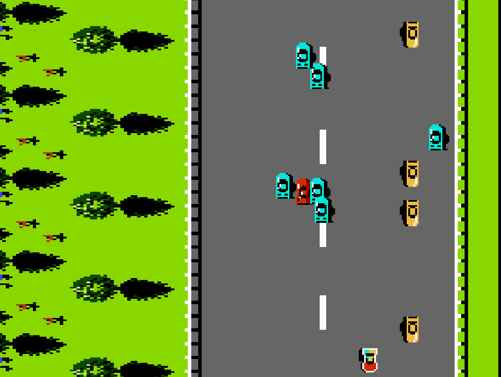

    <h1>RoadFighter</h1>
    

This is a project made by Thibaut Van Goethem for the course "gevorderd programmeren"
The project is going to be an implementation of the NES game roadfighter using SFML
don't forget use sfml 2.4.2
